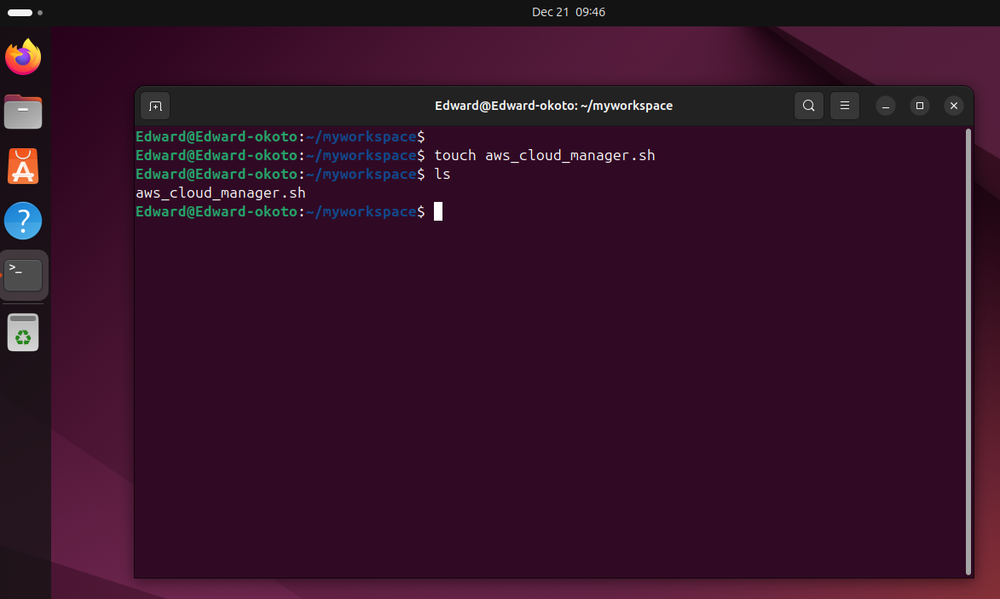
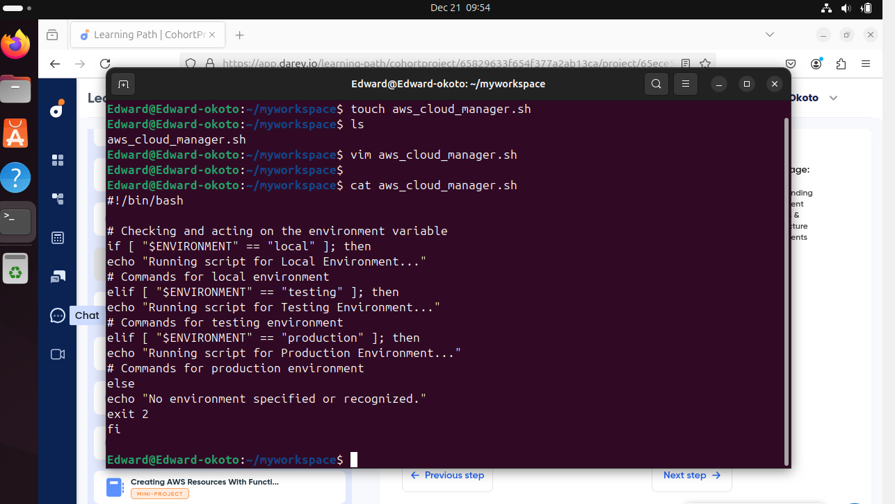
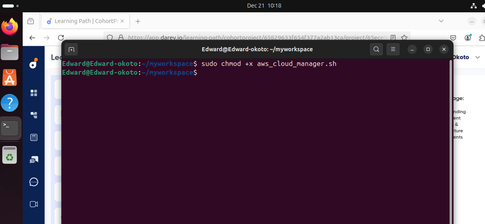
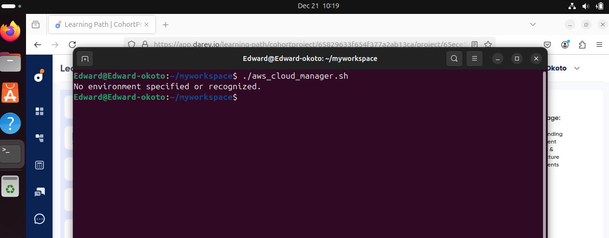
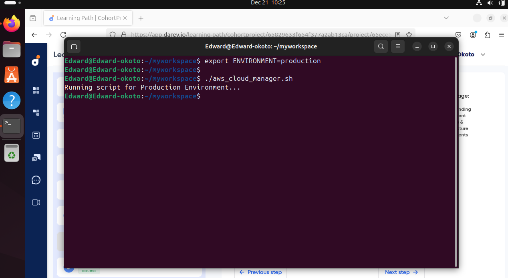
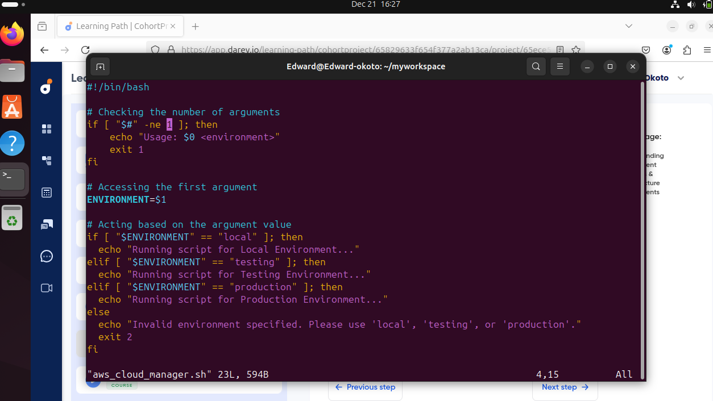
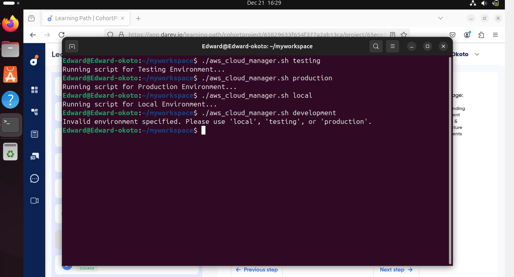

# Understand Environmental Variables and Infrastructure Environment

###  Infrastructure Environment

This refers to various settings where software applications are developed, tested and deployed,each serving a unique purpose in the software lifecycle.

For example, lets say you are working with a biztech company and they have two AWS accounts.

This is what will likely play out.

1. Vitualbox + Ubuntu : The development environment to enable developers work locally from their computer.

 2. AWS Account 1: The testing environment where after local development is completed, the code is pushed to the ECS instance for testing.

 3. AWS Account 2 : The production environment where after test are completed in AWS account 1, the code is pushed to an EC2 instance in AWS Account 2,where the customer consume the tech product through a website.

 ### Environmental Variables

 Imagine your Biztech products needs to connect to a database to fetch financial data.However, the details of the database connection like the database URL, username and password differ between your development, testing and production environments. If you need a shell script that can be reused accross all three (3) environment, then it is important to dynamically fetch the correct value for your connectivity to these environments.

  #### Development Environment Variables: (VirtualBox + Ubuntu)
  
   Environment Variables

  DB_URL=Localhost

  DB_USER=test_user

  DB_USER=test_pass

  Here the environmental variable point to a local database on your laptop where you can safely experiment without affecting the real or test data.

   #### Test Environment : (AWS account 1)

   Environment Variables

  DB_URL=testing-db.example.com

  DB_USER=testing_user

  DB_USER=testing_pass

  Here the environmental variable are configured to connect to a remote database dedicated to testing. This ensures that test are carried out in a controlled environment that simulates production settings without risking actual customer data.

  #### Production Environment : (AWS account 2)

   Environment Variables

  DB_URL=production-db.example.com

  DB_USER=prod_user

  DB_USER=prod_pass

  When the application is running in the production environment,the environment variables switch to ensure the application connects to the live database. This is where real customer interaction happens and the data needs to be accurate and secure.

  By clarifying these differences, we have set a solid foundation for navigating the complexity of technology development with greater ease and precision.

  ### Developing shell script to manage Cloud Infrastructure

   Log into your ubuntu destop on virtualBox and open up a terminal.

   * Create a shell script with the name "aws_cloud_manager.sh"

        

* Put the code below into the file.

          #!/bin/bash

         # Checking and acting on the environment variable

         if [ "$ENVIRONMENT" == "local" ]; then
         echo "Running script for Local Environment..."

         # Commands for local environment
         elif [ "$ENVIRONMENT" == "testing" ]; then
         echo "Running script for Testing Environment..."

         # Commands for testing environment
         elif [ "$ENVIRONMENT" == "production" ]; then
         echo "Running script for Production Environment..."

         # Commands for production environment
         else
         echo "No environment specified or recognized."
         exit 2
         fi

       

* Give it the relevant permission to execute the file.

             sudo chmod +x aw_cloud_manager.sh

    
        

* If you execute this script,the script should go into the " else" block simply because there is no $ENVIRONMENT variable set.

  

* Type this command and run the script again.You will get a script that says...."Runnig script for production environment"

      export ENVIRONMENT=production

  
  

  You can see how environment variables can be used to dynamically apply logic in the script based on the requirement you are trying to satisfy.

  The "export" command is used to set key and value for environmental variables.

  * The variable can also be set directly within the script.What this means is that we have hardcoded the script to run the test environment and its no longer dynamic.

        #!/bin/bash

         # Checking and acting on the environment variable
          # Initialize the environment variable
          ENVIRONMENT="testing"

         if [ "$ENVIRONMENT" == "local" ]; then
         echo "Running script for Local Environment..."

         # Commands for local environment
         elif [ "$ENVIRONMENT" == "testing" ]; then
         echo "Running script for Testing Environment..."

         # Commands for testing environment
         elif [ "$ENVIRONMENT" == "production" ]; then
         echo "Running script for Production Environment..."

         # Commands for production environment
         else
         echo "No environment specified or recognized."
         exit 2
         fi

### Positional Parameters in Shell Scripting

   It is usually not a good practise to hardcode values into script,instead we aim for flexibilty by allowing script to accept input dynamically.This is where positional parameters come in- A capability in shell scripting that allows passing argument to scipt at run time and then replaces the argument with the parameters inside the script.

   * The argument passed to the script is the value that is provided at runtime.
    As in the case below where the environment is "testing", it is also the value to the variable within the script BUT this time the environmental variable will take a dynamic model.

          ./aws_cloud_manager.sh testing

* Therefore, Inside the script, 
         
         ENVIRONMENT=$1

 * SCRIPT IS THEREFORE,

         #!/bin/bash

          # Initialize the environment variable
          ENVIRONMENT=$1

         if [ "$ENVIRONMENT" == "local" ]; then
         echo "Running script for Local Environment..."

         # Commands for local environment
         elif [ "$ENVIRONMENT" == "testing" ]; then
         echo "Running script for Testing Environment..."

         # Commands for testing environment
         elif [ "$ENVIRONMENT" == "production" ]; then
         echo "Running script for Production Environment..."

         # Commands for production environment
         else
         echo "No environment specified or recognized."
         exit 2
         fi
    

 * $1 is the positional parameter which will be replaced by the argument passed to the script.

  Because it is posible to pass multiple argument to a script,dollar sign $ is used to prefix the position of the argument passed to the script. Imagine if another variable within the script is called NUMBER_OF_INSTANCES that determines how many instances get provisioned, then calling the script might look like this:

    ./aws_cloud_manager.sh testing 5

The position parameters inside the script will then look like

     ENVIRONMENT=$1

     NUMBER_OF_INSTANCES=$2

Each positional parameter within the script corressponds to a specific argument passed to the script and each positional parameter is represented by an index number.

 In the case of " ./aws_cloud_manager.sh testing 5" ,we have two positional parameters

 position 1 is for testing and position 2 is 5.However, it should be noted that the script itself occupies position 0.

 ### Condition to Check the Number of Argument.

 Creating shell scripts to meet specific requirements is one aspect of development but ensuring their cleanliness and freedom from bugs is equally crucial. Integrating logical checks periodically to validate data is considered a best practise in script development.

 A prime example of this is verifying the number of arguments passed to the script, ensuring that the script receives the correct input required for its execution, and providing clear guidiance to users in the case of incorrect usage.

 * The below code ensures that when a script is executed,exactly 1 argument is passed to it, otherwise it fails with an exit code of 1 and shows a message telling the user how to use the script.
  
       
       
        #!/bin/bash
        # checking the number of argument
        if [ "$#" -ne 0 ]; then
         echo "Usage:" $0 <environment>
         exit 1
        fi

         # Checking and acting on the environment variable
          # Initialize the environment variable

          ENVIRONMENT=$1

         if [ "$ENVIRONMENT" == "local" ]; then
         echo "Running script for Local Environment..."

         # Commands for local environment
         elif [ "$ENVIRONMENT" == "testing" ]; then
         echo "Running script for Testing Environment..."

         # Commands for testing environment
         elif [ "$ENVIRONMENT" == "production" ]; then
         echo "Running script for Production Environment..."

         # Commands for production environment
         else
         echo "No environment specified or recognized."
         exit 2
         fi

   * $# is the special variable that holds the number of arguments passed to the script.
   * "-ne" means "Not equal"
   * $0 represent the positional parameter of 0, which is the script itself.

   Hence, if the number of argument is not equal to 1, show the echo message.

   The final script should look like this.

        # checking the number of argument
        if [ "$#" -ne 0 ]; then
         echo "Usage:" $0 <environment>
         exit 1
        fi

    
          # Accessing the first argument

          ENVIRONMENT=$1

         # Acting based on the argument value
         if [ "$ENVIRONMENT" == "local" ]; then
         echo "Running script for Local Environment..."
         elif [ "$ENVIRONMENT" == "testing" ]; then
         echo "Running script for Testing Environment..."
         elif [ "$ENVIRONMENT" == "production" ]; then
         echo "Running script for Production Environment..."
         else
         echo "No environment specified.Please use "local" ,    "testing" or "production" "
         exit 2
         fi
       

    
    